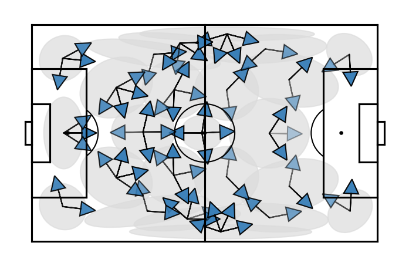

# soccermix
SoccerMix is a soft clustering technique based on mixture models that decomposes event stream data into a number of *prototypical* actions of a specific type, location, and direction.

Here is an example of 71 different prototypical passes discovered by SoccerMix.
 

Copyright 2020 Tom Decroos, Maaike Van Roy, Jesse Davis
